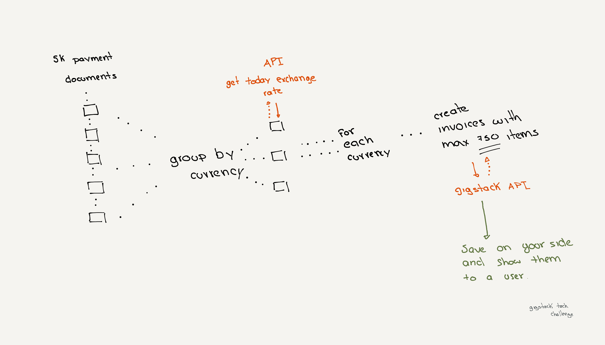

# Technical Challenge for Full-Stack Developers

## Why

The goal of this technical challenge is to prove the ability to solve a technical problem by proposing and developing a scalable solution using our stack.

## The Case

Imagine the following scenario:

Two online stores (Ecommerce1, Ecommerce2) hit a sales their sales record in December 2023, many of their customers do not require an invoice so global invoices for these payments must be created at the end of the month. This function must be executed at 23:59 (America/Mexico_City timezone) on the last day of the month.

Invoices can only be created in a single currency, and if the currency is different from (MXN) Mexican pesos, the exchange rate must be specified.

Each global invoice can contain multiple payments, but for this challenge, the number of items in each invoice cannot exceed 750 items. All items of payment must be in the same global invoice.

You can identify payments from each e-commerce by the key "accountId" in each payment:

- Ecommerce1: team_cjf5GBxz60sqHfs
- Ecommerce2: team_xvHTilvNssRf7rw

Note: A global invoice is an invoice that includes multiple payments, usually issued using the legal name: PUBLICO EN GENERAL, RFC: XAXX010101000, and Fiscal Regime: Sin obligaciones fiscales, with any postal code in Mexico.

Note: You can use the following configuration for the global invoice:

- Payment method: Pago en parcialidades o diferido
- Payment form: Por definir
- Use: Sin efectos fiscales
- Invoice type: Ingreso

## Goals

1. Create a function that runs at the last minute of the month to generate global invoices for Ecommerce1 and Ecommerce2 by calling the Gigstack API.
2. Group global invoices by currency and use the exchange rate of the day when the currency is different from the Mexican Pesos (MXN).
3. Ensure that each global invoice does not contain more than 750 items.
4. Develop a dashboard to visualize payments and invoices, showing real-time updates.

## Answer the Questions

1. **How do you ensure that your solution is scalable for “n” number of online stores?** 

2. **If each e-commerce increases its sales by 10% each month and the number of online stores increases by 15% each month, how do you ensure that your code will execute all global invoices in one minute?**

## Requirements

1. Use the Gigstack API to create invoices ([Gigstack API Documentation](https://gigstack.xyz/api-docs)).
2. Use the payments.json dataset provided in this repo (data/payments.json).
3. Use an exchange rates API to retrieve the exchange rate of the day; we recommend using [ExchangeRate-API](https://www.exchangerate-api.com/).
4. Use cloud functions to create the necessary server functions for your proposal (deployment is not required).
5. Use [ant.design](https://ant.design) to design the components.
6. Use Firebase Firestore to store data.
7. Use the GCP resources that you consider appropriate for your solution (deployment is not required).
8. Submit your solution in a zip file or provide access to a GitHub repository.
9. In each call to the Gigstack API, add your email to the metadata.

## Resources

- [Ant Design](https://ant.design)
- [Firebase](https://firebase.google.com)
- [Firebase Functions](https://firebase.google.com/docs/functions)
- [Cloud Functions Documentation](https://cloud.google.com/functions/docs)
- [Firebase Firestore Documentation](https://firebase.google.com/docs/firestore)
- [ReactFire](https://github.com/FirebaseExtended/reactfire)
- [Gigstack API Documentation](https://gigstack.xyz/api-docs)
- [ExchangeRate-API](https://www.exchangerate-api.com/)
- [Atomic Web Design](https://bradfrost.com/blog/post/atomic-web-design)
- [Gigstack](https://gigstack.pro)